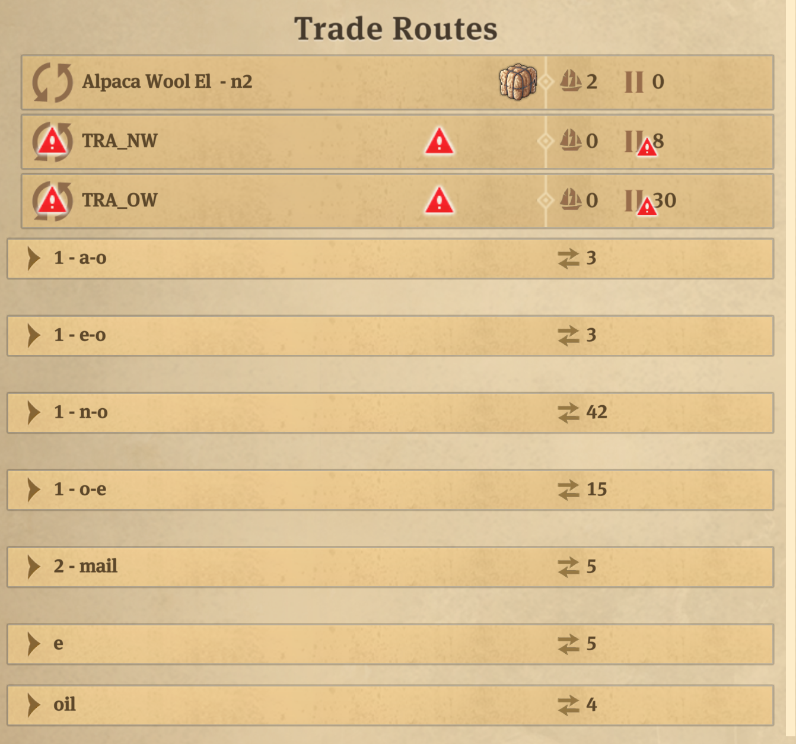
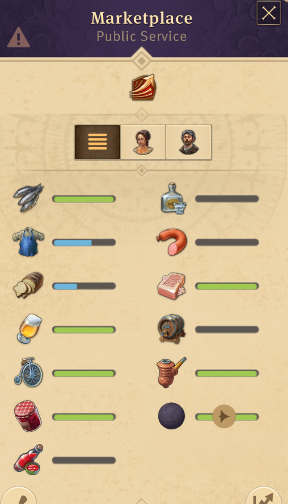
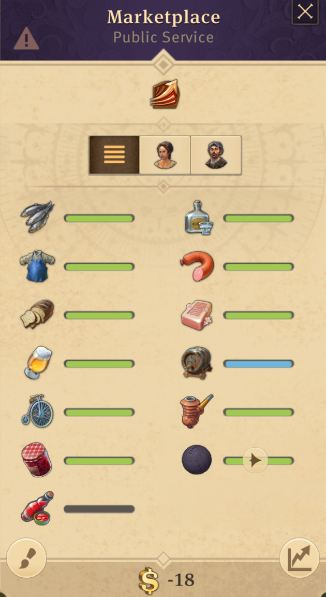
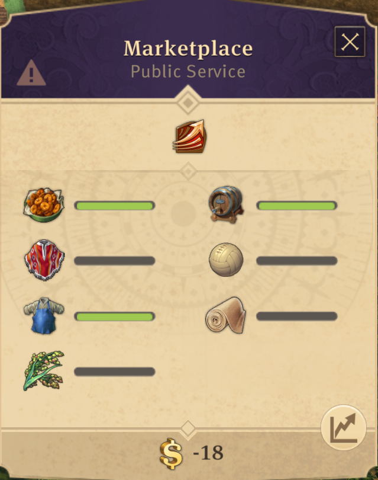
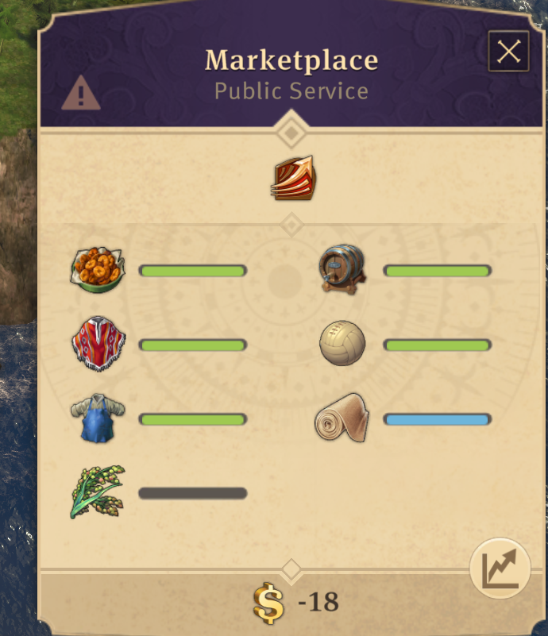
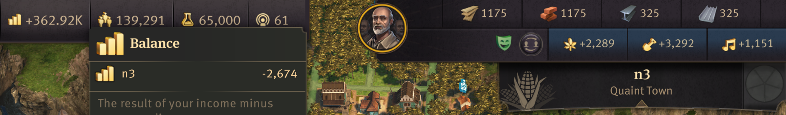
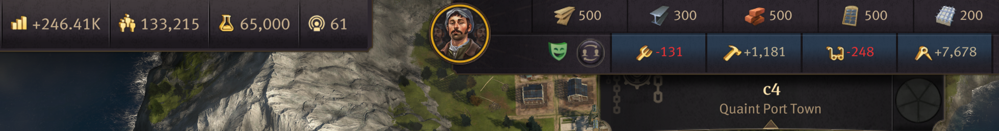
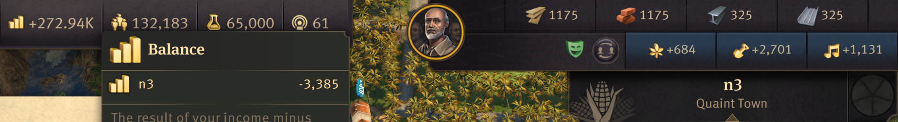
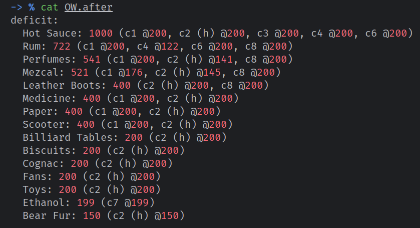

# Anno 1800 mod that automates goods management between islands

Inspired by https://www.reddit.com/r/anno/comments/hp5uac/automatic_trade_routes_anno_1800/,
but implemented in game's Lua.

The mod manages a set of ships to transfer goods between islands inside a region, based on islands' goods stock and
requests.

The mod currently handles trades INSIDE a single region. Cross-region trades are not handled.

TL;DR:

1. Mod is difficult to install, but it works on my machine atm.
2. As a user, you just need to install, start the mod, wait for its 'scan' to complete, and assign ships to a fake trade
   route like 'TRA_OW' for Old World region automation.
   The mod will automatically manage those ships AND detect what goods what islands need
   (residences/factories, even construction goods).

Check [Before/after mod when no in-region trade routes exist (except oil and mail)](#beforeafter-mod-when-no-in-region-trade-routes-exist-except-oil-and-mail)
for an example.

One of the main goals was to eliminate the manual management of trade routes. Which is tedious and boring for me,
especially if I want to move some production from one island to another.

## Installation

This part is not automated and is not up to Anno 1800 mod standards yet.

Good luck :kekw:

In theory:

1. Install https://mod.io/g/anno-1800/m/console.
2. Execute the following:

```shell
make install "INSTALL_BASEDIR=<path to Anno 1800 directory (NOT MODS, NOT SAVEGAMES, real game dir)>/lua"
```

3. Start the game with the console mod enabled.
4. Set game speed to either "Slow Down" or "Regular" _on first mod run_.
   - It appears that "Fast" speed sometimes works.
   - But the "Fastest" speed definitely breaks the scanning process.
5. Open the console (Shift+F1 by default) and execute:

```lua
dofile("lua/_executor.lua"); console.toggleVisibility()
```
6. The mod should start working for this game session in the current region.
7. Wait for the current region to be fully scanned (for the camera to stop moving). Once done, the mod will start
   managing ships in the current region.
8. Switch to other regions and wait for them to be scanned as well (just visit them in the game, the mod will start
   working automatically).
9. Once all regions are scanned, you can set game speed back to the preferred one.
10. Check [Ship assignment](#ship-assignment) section below to assign ships to the mod.

If you restart the game, you have to re-execute step 5. But the mod will remember all islands and ship assignments from
previous runs.
As long as it is the same game session (same save game), you do not need to rescan islands (*).

BEWARE: the camera will start moving on its own. This is the mod scanning islands in the region.
The scanning process is relatively slow (it will take several minutes per region).
After the scanning is done, the camera will stop moving and the mod will start managing ships in the current region.

NOTE: copy-pasting commands to console WORKS, as long as you remove `□` characters that appear when copying.

NOTE: if scanning misbehaves, consider checking if that island was properly scanned.
Check [readme.md](docs/images/area-visualzer/readme.md).

(*) - NOTE: the mod does not support multiple save games. The island scanning data is global, not per save game.
If you start a new save game, delete `<path to Anno 1800 directory>/lua/trade-routes-automation/cache/regions/`.

It will force a full rescan.

### Ship assignment

The mod uses ships that are assigned to a fake `TRA_${REGION_NAME}` trade route.

| Trade Route Name | Region Name        |
|------------------|--------------------|
| `TRA_OW`         | Old World          |
| `TRA_NW`         | New World          |
| `TRA_AR`         | Arctic (*)         |
| `TRA_EN`         | Enbesa (*)         |
| `TRA_CT`         | Cape Trelawney (*) |

The trade route must be created manually, the ships should also be assigned to it manually.
The ships MUST be in the relevant region, mod DOES NOT move ships between regions.

TODO - better handle when ships are added to the trade route after the mod starts.
At the moment, the ship can only be added to the trade route IF:

- the ship name is at most 2 letters; otherwise, the mod might fail to use the ship (the mod will misbehave when using
  the ship).
- the ship _cargo_ must be empty; otherwise the mod will not use the ship.

However, the mod automatically handles the above when it is restarted.

NOTE: the mod stores ship assignments in the ship names. A name like 'k-7n-gd-2lA' is not a bug, but an encoded 4-tuple
of ship short name, ship destination X and Y coordinates, and the destination area ID.

(*) - islands not supported, but it should be relatively easy to add support.

### Hub cities

If the mod has 'idle' ships (ships assigned to automation, but not currently executing any trade), it will try to
send goods to hub cities (ones that have "(h)" in the end of their name).

The hub city will automatically request all goods from all other islands until 90% of its total capacity is used.

## Before/after mod when no in-region trade routes exist (except oil and mail)


^^ trade routes example.

Routes groups like "A-O", "O-E", "N-O" are cross-region trade routes. I don't have any in-region routes except oil and
mail.

That alpaca wool trade route is to Isabel trader to sell surplus wool from my NW island to keep generating
dung/fertilizer.

| Without mod                                                                                  | With mod                                                                                                                  |
|----------------------------------------------------------------------------------------------|---------------------------------------------------------------------------------------------------------------------------|
| old world city supply                | no hot sauce in the region<br/>                                     |
| new world city supply                | no Enbesa Teff available in region<br/>                             |
| new world population                 | <br/>                                                               |
| old world population                 | <br/>                                                               |
| old world 'deficit' | most solved, others require players' attention<br/> |

# Implementation details

## List of "low-level" features

- scanning
    - scan current region to detect all islands (*),
    - scan all detected islands to detect players' islands with approximate coast locations (*),
    - scan all players' ships and detect ships assigned to this mod (through a specific trade route name),
- trading
    - given a ship, a source and destination island, and a specific good, the mod can:
        - move the ship to the source island's pier,
        - load the good from the source island to the ship,
        - move the ship to the destination island's pier,
        - unload the good at the destination island (fully)
    - detect all islands' goods stock, requests, and total capacity,
        - requests are also automated, the mod checks island's buildings/residences and their consumptions (**),

Notes:
(*) - the scanning process is quite slow (it automatically moves camera around to find islands).
It takes me 7 minutes for the Old World region where I have 9 islands (incl. big ones).
This process result is _cached_ on disk, but not YET associated with a specific game or save.

(**) - there are two known problems so far:

1. Residences and factories consumption info is hardcoded per building type. If a mod changes that, this mod will not be
   aware of it.
   But, the detection is automated. The current implementation could be extended to dynamically scan all buildings'
   consumption.
   Plus, not all residences were scanned yet, so some goods requests may be incomplete.
2. Trade unions and harbormasters items that change consumption items are not handled yet.
