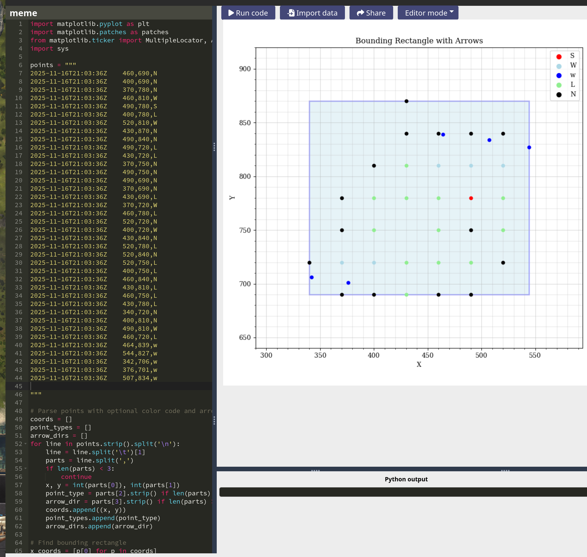
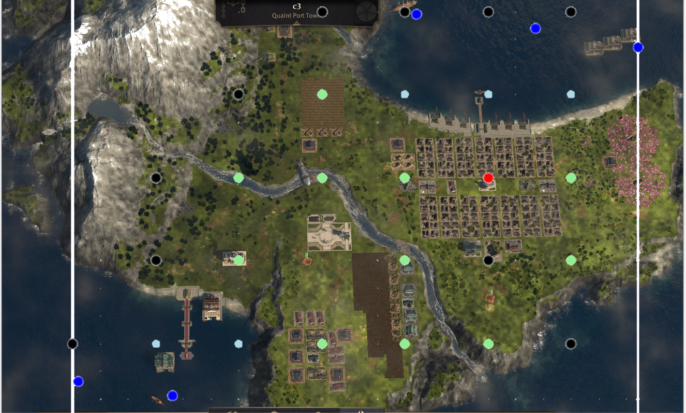

`C:/users/<user>/Documents/Anno 1800/mods/TradeRoutesAutomation_DEV/logs/TrRAt_*.tsv` has island scan data that can be visualized using matplotlib.

You could use the following script ([area-visualizer-online.py](../../../utils/area-visualizer-online.py)) with https://matplotlib.online/ to visualize the island scan results.

## Example

 - island screenshot from the game.

 - island's scan results visualized using matplotlib.

 - islands screenshot with scanner result on top.

The dark blue dots are the point where mod will perform load/unload ships operations with this island.
The light blue dots are real coast points detected by the mod.
The black dots are 'inaccessible' island points.

I manually made that island with scanner points picture, so points are not exactly aligned, but close enough.